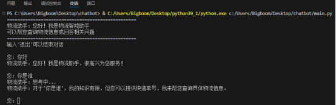
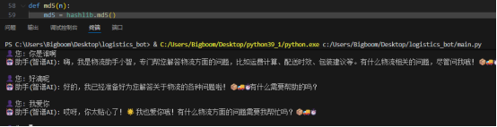
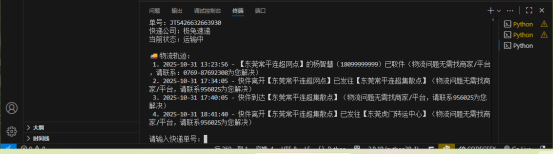
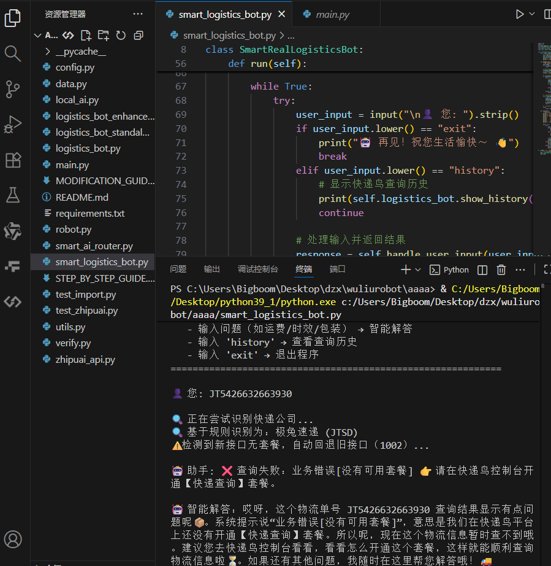

# 🚀 智能物流机器人（Smart Logistics Robot）
[English Version 🇬🇧](./README_EN.md) | [中文版 🇨🇳](./README.md)


> 作者：dzx  
> 基于 Python 的智能物流机器人系统  
> 集成了 **快递鸟 API（物流查询）** 和 **智谱 AI API（智能对话）**  
> 可实现：实时物流查询 + 智能客服对话 + 物流信息学习与记忆  

---

## 🧠 项目简介

本项目是一个能够 **查询真实快递物流信息** 并进行 **智能自然语言对话** 的机器人系统。  
项目分为四个阶段开发，逐步实现了从规则问答到多接口融合的完整智能机器人体系。

---

## 📁 项目结构

| 文件夹 | 功能说明 |
|--------|-----------|
| `chatbot` | 基于问答库的初代物流机器人，只能回答预设问题。 |
| `ai_robot` | 接入智谱 AI 接口，实现自由智能对话功能。 |
| `wuliu_robot` | 接入快递鸟 API，实现真实物流信息查询。 |
| `smartwuliu_robot` | 综合前两者，支持智能问答 + 真实物流查询的全功能版本。 |

---

## ✨ 功能特色

- 🤖 **智能问答**：通过智谱 AI 接口，支持开放式语义理解与多轮对话。  
- 📦 **实时物流查询**：通过快递鸟 API 查询真实快递物流信息。  
- 🧩 **多功能融合**：集成多种功能模块（查询、对话、历史记录）。  
- 🧠 **模块化设计**：每个功能独立封装，便于扩展与维护。  
- 💬 **命令行交互**：轻量级 CLI 界面，直接输入即可开始对话或查询。

---

## 🏗️ 技术架构

| 技术 | 说明 |
|------|------|
| **Python 3.9+** | 主开发语言 |
| **智谱 AI API** | 实现智能问答 |
| **快递鸟 API** | 实现真实物流查询 |
| **hashlib / requests / json** | 用于数据处理与网络请求 |
| **命令行界面（CLI）** | 交互式运行环境 |

---

## ⚙️ 环境与运行

### 1️⃣ 克隆项目
```bash
git clone https://github.com/dzx12389/logistics_robot.git
cd logistics_robot
```

### 2️⃣ 安装依赖
```bash
pip install -r requirements.txt
```

### 3️⃣ 运行示例
#### 运行初代问答机器人：
```bash
python chatbot/main.py
```

#### 运行智能对话机器人：
```bash
python ai_robot/main.py
```

#### 运行物流查询机器人：
```bash
python wuliu_robot/main.py
```

#### 运行全功能智能物流机器人：
```bash
python smartwuliu_robot/smart_logistics_bot.py
```

---

## 🧩 使用说明

### 智能物流机器人操作（smartwuliu_robot）：
| 命令 | 功能说明 |
|------|-----------|
| 输入物流单号 | 查询真实物流信息 |
| 输入任意问题 | 进行智能问答 |
| `history` | 查看查询/对话历史 |
| `exit` | 退出程序 |

---

## 📷 运行截图展示

### 🧱 1️⃣ 初代问答机器人（chatbot）


### 🧠 2️⃣ 智能对话机器人（ai_robot）


### 📦 3️⃣ 实时物流查询机器人（wuliu_robot）


### 🚀 4️⃣ 智能物流机器人（smartwuliu_robot）


---

## 🔌 接口配置

### 智谱 AI 接口（Zhipu API）
在 `config.py` 中设置：
```python
ZHIPU_API_KEY = "你的智谱API密钥"
```

### 快递鸟 API（KDNiao API）
在 `config.py` 中设置：
```python
KDNIAO_API_KEY = "你的快递鸟API密钥"
KDNIAO_USER_ID = "你的商户编号"
```

---

## 🌱 未来计划
- [ ] 支持 GUI 图形化界面  
- [ ] 增加多模型对话引擎  
- [ ] 添加多平台语音接口  
- [ ] 优化历史记录与上下文记忆  

---

## 📜 许可证
本项目仅供学习与研究使用，禁止用于商业用途。  
版权所有 © 2025 dzx

---

## ❤️ 致谢
特别感谢：
- [智谱 AI](https://open.bigmodel.cn/) 提供智能语言能力  
- [快递鸟](https://www.kdniao.com/) 提供物流查询接口  
- 所有支持与测试本项目的开发者与同学们 🙌
